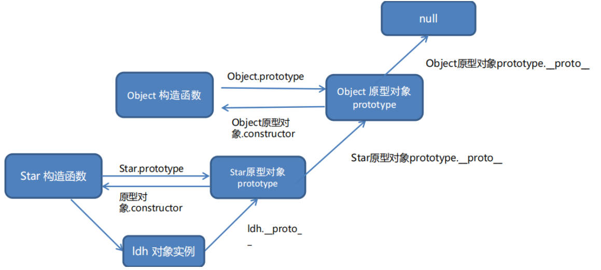
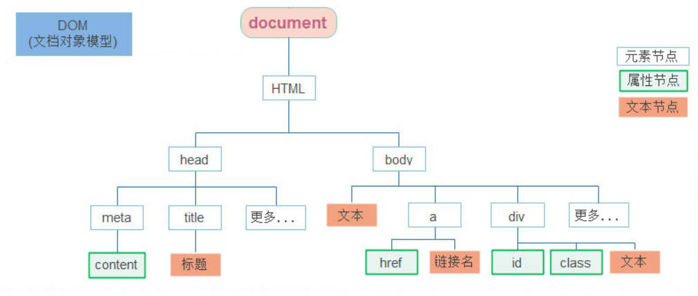

# JavaScript

官网文档：https://developer.mozilla.org/zh-CN/docs/Web/JavaScript

参考手册：https://www.w3school.com.cn/jsref/index.aspz

语法检查工具： [jslint](http://www.jslint.com/)

# 第一部分 ECMAScript

## 1. 背景

> 廖雪峰 JavaScript：https://www.liaoxuefeng.com/wiki/1022910821149312/1023020745357888

### 1.1 10 天设计完的 JavaScript

1995 年，Brendan Eich 用 10  天时间设计完成，但因为时间紧，不可避免存在缺陷。

javascript 是网景 (Netscape) 公司，最早名称 LiveScript，为吸引更多 java 程序员，更名为 javascript。实际没啥关系，硬要说的话，就语法和 java 类似点。

**弱类型**

①交互性；②安全性（不允许直接访问本地硬盘）；③跨平台性（有解释 js 的浏览器即可执行，与平台无关）

ECMAScript（European Computer Manufacturers Association）是一种语言标准，而 JavaScript 是网景公司对ECMAScript标准的一种实现。

由于 JavaScript 的标准——ECMAScript 在不断发展，ECMAScript 6标准（简称ES6）于 2015 年 6 月正式发布，改动最多，主要是让 JS 工程化，构建化。一般讲到 JavaScript的版本，实际上就是说它实现了 ECMAScript 标准的哪个版本。

### 1.2 组成

**ECMAScript**

JS 的基础语法核心知识

**Web APIs**

- DOM：操作文档，对页面元素进行移动、删除、添加等操作
- BOM：操作浏览器，如页面弹窗、检测窗口宽度、存储数据到浏览器等


## 2. 快速入门

### 2.1 放置的位置

**1.放在 `<head></head>` 中**

```html
<html>
<head>
  <script>
    alert('Hello, world');
  </script>
 <script src="/static/js/abc.js" type="text/javascript"></script>
</head>
<body>
  ...
</body>
</html>
```

**2.放置在文件 .js 中**

在 `<head> <\head>` 中通过 `<script src="/static/js/abc.js"></script>` 进行引用。可以多次编写`<script> js代码... </script>`，浏览器按照顺序依次执行。

有时候会设置 `type="text/javascript"` ，不太必要，因为默认的类型就是 `javascript`。

### 2.2 基本语法

**建议每个语句以`;`结束**，虽然不是必须要求的

行注释：`\\`

块注释是用：`/*...*/`

**strict 模式**

要求强制使用 `var` 申明变量，未通过 `var` 申明的变量，会自动申明为全局变量。

使用 `var` 申明的变量则不是全局变量，它的范围被限制在该变量被申明的函数体内，同名变量在不同的函数体内互不冲突。

为修补缺陷，推出 ECMA 推出 strict 模式，在这种模式下运行 JavaScript 代码，未使用 `var` 申明变量就使用，将会导致运行错误。

```javascript
//代码第一行写上
'use strict'
```

不支持 strict 模式的浏览器会把它当做一个字符串语句执行，支持 strict 模式的浏览器将开启strict模式运行JavaScript。

### 2.3 数据类型

不区分整数和浮点数，统一用 Number 表示：

数值型 number

字符串 string

对象类型 object

布尔类型 Boolean

函数类型 function

特殊值：null 空值;

**数组可包括任意类型**

**动态语言，变量本身的类型不固定**

```javascript
var arr = [1, 2, 3.14, 'Hello', null, true];
```

### 2.4 字符串和数组

转义字符 **`\ `**

ES6标准新增了一种多行字符串的表示方法，用反引号 **\`...\`** 表示

**模板字符串**

ES6 的新语法：用于拼接字符串和变量。

- 用反引号 **\` \`** 表示
- 变量用 `${}` 表示

**字符串连接**

```javascript
var name = '小明';
var age = 20;
//1.加号连接
var message = '你好, ' + name + ', 你今年' + age + '岁了!';
//2.ES6新增的模板字符串
var message = `你好, ${name}, 你今年${age}岁了!`;
```

**常见操作**

- `s.length;`
- `s.toUpperCase()`

**数组**

对数组没有明确的限制，但是在编写代码时，**不建议直接修改 `Array` 的大小，访问索引时要确保索引不会越界**。

- `arr.splice()`
- `arr.push()`
- `arr.pop()`
- `arr.unshift()`
- `arr.shift()`

```javascript
//数组切片，从索引0开始，到索引3(不包含索引3)
b = arr.slice(0, 3);
// 从索引2开始删除3个元素,然后再添加两个元素:
arr.splice(2, 3, 'Google', 'Facebook');
//从索引2开始，不删除元素
arr.splice(2, 0);
```

添加和删除元素：

```javascript
//末尾 push 添加；pop 删除
arr.push('a', 'b');
arr.pop();

//头部添加
arr.unshift('a', 'b');
arr.shift();
```

### 2.5 对象

判断一个属性是否是 `xiaoming` 自身拥有的，而不是继承得到的，可以用 `hasOwnProperty()` 方法：

```javascript
var xiaoming = {
    name: '小明',
    singing: function () {
        console.log('两只老虎，两只老虎，跑的快，跑的快...')
      },
    run: function () {
        console.log('我跑的非常快...')
      }
};
xiaoming.hasOwnProperty('name'); // true
xiaoming.hasOwnProperty('toString'); // false
// 动态添加方法
xiaoming.move = function () {
      console.log('移动一点距离...');
}
```

JavaScript 的对象的键必须是**字符串**。但实际上 Number 或者其他数据类型作为键也是非常合理。因此 ES6 规范引入了新的数据类型 `Map`。

**遍历对象：**

```javascript
//k 返回的对象的属性名，属性的类型为字符串
for (var x in obj){
    console.log("属性名："+n);
    console.log("属性值："+obj[n]);
}
```

**Map() 和 Set()**

```javascript
//Map()
var m = new Map();
var m = new Map([['Michael', 95], ['Bob', 75], ['Tracy', 85]]);
m.set('Adam', 67); 
m.get('Adam');
//Set()
var s2 = new Set([1, 2, 3]); 
s2.add(5)
```

遍历 `Array` 可以采用下标循环，遍历 `Map` 和 `Set` 就无法使用下标。为了统一集合类型，ES6 标准引入了新的`iterable` 类型，`Array`、`Map `和`Set `都属于 `iterable` 类型。

`forEach()` 方法是ES5.1标准引入 (它接收一个函数，每次迭代就自动回调该函数) ：

```javascript
var = new Set(['A', 'B', 'C']);
//当前元素的值，当前元素的索引，对象本身
s.forEach( function(element, sameElement, array){
    
} )
```

### 2.6 let 和 const

JavaScript 关键字: **let** 和 **const**。

2015 年前，使用 var 声明 JavaScript 变量，2015 年后的 JavaScript 版本 (ES6) 允许使用 const 定义一个常量；let 定义其作用域的变量；Symbol 是 ES6 引入了一种新的原始数据类型，表示独一无二的值。

- let 声明的变量只在 let 命令所在的代码块内 `{...}` 有效。

- const 声明一个只读的常量，一旦声明，常量的值就不能改变。

**var 和 let**

**推荐使用 let，let 更加标准，解决 var 的缺陷问题**

var 缺陷：1.可先使用再声明；2.var 可重复声明; 3.无块级作用域，变量提升，全局作用域。

在函数体内使用 **var** 和 **let** 关键字声明的变量有点类似，作用域都是 **局部的**；在函数体外或代码块外使用 **var** 和 **let** 关键字声明的变量也有点类似，它们的作用域都是 **全局的**。

```javascript
'use strict';
function foo() {
    for (var i=0; i<100; i++) {
        //
    }
    i += 100; // 仍然可以引用变量i
}
//let
'use strict';
function foo() {
    var sum = 0;
    for (let i=0; i<100; i++) {
        sum += i;
    }
    // SyntaxError:
    i += 1;
}
```

ES6 新的赋值语句 — 解构赋值：

```javascript
let [x, [y, z]] = ['hello', ['JavaScript', 'ES6']];
//要使用的变量名和属性名不一致
var person = {
    name: '小明',
    age: 20,
    gender: 'male',
    passport: 'G-12345678',
    school: 'No.4 middle school'
};

// 把passport属性赋值给变量id:
let {name, passport:id} = person;
```

### 2.7 this 和 for 循环

隐含的参数，解析器在调用函数每次会向函数的内部传递一个隐含的参数。

1.以函数形式调用时，this 指向 window

2.以方法形式调用时，this 指向调用方法的那个对象

第一个参数就是需要绑定的 `this ` 变量，第二个参数是 `Array`，表示函数本身的参数。对普通函数调用，我们通常把this绑定为null。

- `apply() ` 把参数打包成 `Array` 再传入；
- `call() ` 把参数按顺序传入。

```javascript
//apply可以对函数进行改造，充当装饰器
'use strict';

var count = 0;
var oldParseInt = parseInt; // 保存原函数

window.parseInt = function () {
    count += 1;
    return oldParseInt.apply(null, arguments); // 调用原函数
};
```

**for 循环**

`for ... of` 循环和 `for ... in  ` 循环有何区别

`for ... in  `循环将把 `name` 包括在内，但 `Array` 的 `length` 属性却不包括在内。

`for ... of `循环则完全修复了这些问题，它只循环集合本身的元素。

### 2.8 高阶函数

**map**

`map() ` 方法定义在 JavaScript 的 `Array` 中，`map()` 传入的参数是函数本身。

```javascript
'use strict'
function pow(x){
    return x*x;
}
var arr = [1, 2, -1, 3];
demo = arr.map(pow);

//或者
demo_add = arr.map(function add(x, y){
    return x+y;
}
);
```

**reduce**

实质含义：`[x1, x2, x3, x4].reduce(f) = f(f(f(x1, x2), x3), x4)`

**filter**

过滤函数，**`function (element, index, self){}`**：第一个参数表示数组中的一个元素，后两个参数表示元素的位置和数组本身。

**sort**

排序默认把所有元素先转换为 String 再排序，`sort()` 方法会直接对 `Array` 进行修改，它返回的结果仍是当前`Array`，**注意 sort 对数据排序的不同。**

**every**

`every()` 方法判断数组的所有元素是否满足测试条件。

```javascript
arr = ['apple', 'pear', 'toe'];
arr.every(function(s){
    return s.length > 0;
});
```

**find 返回 元素，`undefined` 和 findIndex 返回 索引，  -1**

### 2.9 闭包

内部函数 `sum` 可以引用外部函数 `late_sum` 的参数和局部变量，当 `late_sum` 返回函数 `sum` 时，相关参数和变量都保存在返回的函数中，这就是“闭包（Closure）”的程序结构。

在没有 `class` 机制，只有函数的语言里，借助闭包，同样可以封装一个私有变量。换句话说，闭包就是携带状态的函数，并且它的状态可以完全对外隐藏起来。

```javascript
function late_sum(arr){
    var sum = function () {
        return arr.reduce(function (x,y){
            return x + y;
        });
    }
    return sum;
}
```

需要注意的是：**每次调用都返回一个新函数，二者互不影响。**

```
var f1 = lazy_sum([1, 2, 3, 4, 5]);
var f2 = lazy_sum([1, 2, 3, 4, 5]);
f1 === f2; // false
```

### 2.10 特殊函数

**匿名函数**

具名函数和匿名函数的区别：

- 具名函数可以写在任何位置
- 函数表达式可先声明后调用

```javascript
//1.函数表达式的形式：
let fn = function(x, y){
    console.log(1);
};

//2.立即执行函数
//本质上后面的 ()，相当于调用
//(function(){})(); (function(){}());

(function (x) {
    return x * x;
})(3); // 9

(function (x) {
    return x * x;
}(3)); // 9
```

**箭头函数 =>**

```javascript
x => x * x
//相当于
function (x) {
    return x*x;
}
```

箭头函数相当于匿名函数，并且简化了函数定义。箭头函数有两种格式：

- 只包含一个表达式，连 `{ ... }` 和 `return` 都省略掉
- 包含多条语句，不能省略 `{ ... }` 和 `return`

```javascript
//可变参数
(x, y, ...rest) => {
    var i, sum = x + y;
    for (i=0; i<rest.length; i++) {
        sum += rest[i];
    }
    return sum;
}
```

实际上，箭头函数和匿名函数有个明显的区别：箭头函数内部的 `this` 是词法作用域，由上下文确定。

箭头函数完全修复了 `this` 的指向，`this` 总是指向词法作用域，也就是外层调用者 `obj`。

**生成函数-可多次返回的函数**

除了 return 语句，还可以用 yield 返回多次。

```javascript
function* foo(x) {
    yield x + 1;
    yield x + 2;
    return x + 3;
}
//next() 方法会执行 generator 代码
var f = foo(5);
f.next()
```

第二种调用方法：

```javascript
for (var x of f00(5)){
    condsole.log(x);
}
```

### 2.11 逻辑中断

类似于默认参数的设置：

```javascript
//未传参数时，以x=0,y=0表示
function fn(x, y){
    x = x || 0;
    y = y || 0;
    return x+y;
}
```


## 3.面向对象

### 3.1 类型判断 typeof

`typeof 123;` 返回相关类型。

- `typeof` 操作符可以判断出 `number`、`boolean`、`string`、`function` 和 `undefined`；
- 判断 `Array `要使用 `Array.isArray(arr)`；
- 判断 `null` 请使用 `myVar === null`；
- 判断某个全局变量是否存在用 `typeof window.myVar === 'undefined'`；
- 函数内部判断某个变量是否存在用 `typeof myVar === 'undefined'`
- 用 `parseInt()` 或 `parseFloat()` 来转换任意类型到 `number`；
- 用 `String() `来转换任意类型到 `string`，或者直接调用某个对象的 `toString()`方法；

### 3.2 标准对象

**Date**

**注意的是：**JavaScript 的月份范围用整数表示是 **0~11**，`0  `表示一月，`1 ` 表示二月等等。

```javascript
var date = new Date();
//ES6引入的获得当前时间,毫秒级表示
temp = Date.now();
var d = new Date(temp);

years = date.getFullYear();
months = date.getMonth();
days = date.getDay();
date_time = date.getDate();
time = date.getTime();
console.log(years, date_time, months);
console.log(time);
```

**RegExp**

特殊字符，在正则表达式中，要用 `\` 转义

`()`：表示的就是要提取的分组（Group）

`\d`：匹配一个数字

`\w`：匹配一个字母

`.` ：匹配任意的字符

`*`：表示任意个字符（包括0个)

`+` ：表示至少一个字符

`?`：表示 0 个或 1 个字符

`{n,m} `：表示 n-m 个字符

`^`：表示行的开头，`^\d`表示必须以数字开头

`$`：表示行的结束，`\d$`表示必须以数字结束

例子：`[a-zA-Z\_\$][0-9a-zA-Z\_\$]{0, 19}`：更精确地限制了变量的长度是1-20个字符（前面1个字符+后面最多19个字符）

**JavaScript 中创建正则表达式**

1.通过 `\ 正则表达式 \`

2.通过 `new RegExp('正则表达式')` 创建一个正则对象

```javascript
var re = /^\d{3}\-\d{3,8}$/;

//test 方法用于测试
re.test('010-12345'); // true
re.test('010-1234x'); // false
```

应用：

**正则匹配默认是贪婪匹配，也就是匹配尽可能多的字符**

```javascript
//识别连续空格 其中：\s 表示空格
'a b   c'.split(/\s+/);

//加个?就可以让\d+采用非贪婪匹配
var re = /^(\d+?)(0*)$/;
```

**JSON**

JSON 是 JavaScript Object Notation 的缩写，它是一种数据交换格式。

在 JSON 出现之前，大家一直用 XML 来传递数据。因为 XML 是一种纯文本格式，所以它适合在网络上交换数据。XML 本身不算复杂，但是，加上 DTD、XSD、XPath、XSLT 等一大堆复杂的规范以后，XML 解读性变差。

- JSON 的字符串规定必须用双引号 `""`
- Object 的键也必须用双引号 `""`

把 JavaScript 对象变成 JSON，就是把对象序列化成一个 JSON 格式的字符串，而后通过网络传递给其他计算机。反之，收到一个 JSON 格式的字符串，只需要把它反序列化成一个 JavaScript 对象即可。

```javascript
//转换为 JSON
var s = JSON.stringify(xiaoming, null, '    ');
//反序列化为 Object
var obj = JSON.parse('{"name":"小明","age":14}', function (key, value) {
    if (key === 'name') {
        return value + '同学';
    }
    return value;
});
```

### 3.3 原型链(prototype)

`Array` 对象的原型链：

```text
arr ----> Array.prototype ----> Object.prototype ----> null
```

`Function` 对象的原型链：

```text
foo ----> Function.prototype ----> Object.prototype ----> null
```

当然，需注意的是：原型链很长，那么访问一个对象的属性就会因为花更多的时间查找而变得更慢。

**用构造函数的方式创建对象**

- 可通过 `new` 关键词调用，并返回一个对象。如果不用 `new`，就是一个普通的函数
- 构造函数习惯于首字母大写，普通函数首字母应当小写
- 无返回值，回自动返回创建的对象
- 创建大批量的对象，使用的构造函数都是 Object 类型，无法区分出多种不同类型的对象

```javascript
//使用构造函数创建的相当于同一个类
function Person(){
    this.name = name;
    this.age = age;
    this.showName = function(){
        alert(this.name);
    }
}
//普通函数的调用
var per = Person();
//构造函数的调用,
//1.立刻创建一个新的对象
//2.将新建的对象设置为函数中this
//3.逐行执行函数中的代码
//4.将新建的对象作为返回值返回
var pop1 = new Person("小明",18);
var pop2 = new Person("小宏",18);

//语法：对象 instanceof 构造函数
```

```text
xiaoming ----> Student.prototype ----> Object.prototype ----> null

实例化的对象
xiaoming ↘
xiaohong -→ Student.prototype ----> Object.prototype ----> null
xiaojun  ↗
```

创建的每个函数，解析器会向函数中添加一个 prototype 属性，这个属性对应一个对象，即所谓的原型对象。

1. `__proto__` 和 `constructor` 属性是**对象**所独有的；

2. `prototype` 属性是**函数**所独有的，但是对于普通函数没有作用。

3. 函数的原型对象:我们创建函数 `A` 的同时, 浏览器会在内存中创建一个对象 `B`。

   `A` 函数默认会有一个 `prototype` 属性，指向了对象 `B`( 即：`prototype` 的属性的值是对象 `B` )。  这个对象 `B` 就是函数 `A` 的原型对象，简称函数的原型。  

   原型对象 `B` 默认会有一个属性 `constructor` 指向了函数 `A` (即 `constructor`属性的值是函数 `A` )。  原型对象默认只有属性 `constructor` 。其他都是从 `Object` 继承而来。

4. 原型对象相当于一个**公共区域**，同一类中的所有实例都可以访问。当访问一个实例对象的属性和方法时，有直接用。否则看原型对象。原型对象中没有，则找原型对象中的原型（原型对象本质上是一个对象），知道找到Object 原型对象位置，如果还没找到，则返回 undefined。



```javascript
//构造函数,prototype
function Myclass(){
    
}
//__proto__ 和 constructor
var mc = new Myclass();
var mc2 = new Myclass();

//向Myclass的原型中添加属性 a，不会污染全局作用域
Myclass.prototype.a =123;
Myclass.prototype.run = function (){
    alert('hi');
};
```

**关于类型的判定**

使用 `hasOwnProperty()` 仅检查**检查对象自身是否有**

```javascript
//用 in 回一直向上找，直到找到或没有
//输出：true
"a" in mc;
//检查对象自身
mc.hasOwnProperty("a")
```

**封装 `new` 操作**

- 不需要 `new` 来调用
- 参数非常灵活，可以不传，也可以传

```javascript
//构造函数
function Student(props){
    this.name = props.name || '匿名'; //默认值为匿名
    this.grade = props.grade || 1;
}
//向原型函数添加方法
Student.prototype.run = function (){
    alert('hi'+ this.name);
}
//封装 new 关键字
function createStudent(props){
    return new Student(props || {})
}

//实例调用
let xiaoming = createStudent({
    name: '小明'
});
```

# 第二部分 Web APIs

## 4.概述

Web APIs 的核心是 DOM 和 BOM。

### 4.1 DOM

动态修改 HTML，用于网页特效及用户交互。

- 元素节点：HTML 标签
- 属性节点：HTML 标签中的属性
- 文本节点：HTML 标签中的文字内容
- 根节点：`<html><\html>`



document 是 JavaScript 内置的专门用于 DOM 的对象：

```html
    <script>
        // 1.获取根节点
        console.log(document.documentElement);
        // 2.获取body节点
        console.log(document.body);
        // 3.向网页中输入内容
        document.write('Hi DOM')
    </script>
```

**获取 DOM 对象**

- **`document.querySelector('p')` ：**获取第一个 p 元素
- **`document.querySelector('.box')` ：**获取选择器
- **`document.querySelectorAll('ul li')`**：获取满足条件的所有元素
- `document.getElementById`，`document.getElementsByTagName` (Element 是否为复数)

`document.querySelectorAll('ul li')`：获取满足条件的集合数组，但不是真正意义上的数组，是伪数组，不具有数组对应的方法，但有**长度和索引号**。

```javascript
for (let i =0; i < lis.length; i++){
    console.log(lis[i]);
}
```

### 4.2 DOM 对象操作

**修改文本内容**

```html
   <script>
        const p_inner = document.querySelector('p');
		//获取选择器
		const selector_inner = document.querySelector('.intro');
        p_inner.innerText = 'innerText 生成';
		//可解析标签
        p_inner.innerHTML = '<h4>可解析标签的 innerHTML</h4>';
    </script>
```

**style 样式操作**

- 修改样式属性 **对象.style.样式属性 = '值（单位）'**  
- 如果属性有 `-` 连接符，使用小驼峰命名法避免冲突；

```html
<head>
    <style>
        /* css样式 */
        .box {
            width: 200px;
            height: 200px;
            background-color: aqua;
        }
    </style>
</head>    
<body>
    <div class="box"></div>
    <script>
        const box = document.querySelector('.box');
        box.style.width = '100px';
        //注意“backgroundColor”的小驼峰引用方式
        box.style.backgroundColor = 'green';
    </script>
</body>
```

**类名操作**

- `div.className()`：单个类的添加，会覆盖之前的类
- `div.classList.add()`：添加类
- `div.classList.remove()`：移除类
- **`div.classList.toggle()`：切换类，有则删除，没有则加上。**

```html
    <style>
        /* css样式 */
        .box {
            width: 200px;
            height: 200px;
            background-color: aqua;
        }
    </style>
</head>
<body>
    <div></div>
    <script>
      //为 div 增添类，用新值换旧值
        const div = document.querySelector('div');
        div.className = 'box';
        // 添加多个类：div.className = 'box nav';
    </script>
```

**表单元元素属性操作**


## 设计缺陷说明

### 1.比较

JavaScript 设计缺陷，尽量不使用用 `== `比较，而使用 `===` 进行比较

- 第一种是 `==` 比较，它会自动转换数据类型再比较，很多时候，会得到非常诡异的结果；

- 第二种是 `===` 比较，它不会自动转换数据类型，如果数据类型不一致，返回 `false` ，如果一致，再比较

- 判断 `NaN` 的唯一方法为 `isNaN()` 函数，通过 `NaN === NaN` 无法判断

- 不是 JSP 的缺陷：浮点数的相等比较 `1/3 === (1 - 2/3); //false` 这是由计算机误差所产生的，若比较2个浮点数是否相等，只能计算它们差的绝对值，看是否小于某个阈值。

  ```javascript
  Math.abs(1 / 3 - (1 - 2 / 3)) < 0.0000001;
  ```

  

#### 字符串操作

**拼接**

通用的为使用`+`进行，ES6新增一种模板字符串，会自动替换字符串中的变量

```javascript
var name = 'string'
var age = '10'
var temp = `字符串, ${name}, 历史年限 ${age} 年了.`
```

**长度**

```javascript
var x1 = str1.length
```

## 2.JavaScript对象

```javascript
'toString' in objectdemo1;
//用in判断一个属性是否在对象中存在时，可能该属性是由对象继承而来的
//要判断一个属性是否自身拥有而不是继承得到，可以用hasOwnProperty()方法
objectdemo1.hasOwnProperty('name');
```


document.querySelector("#demo")返回文档中匹配指定CSS选择器的第一个元素。querySelectorAll()返回所有元素。

```javascript
<button id="btn">按钮</button>
<script>
//获取对象
var x = document.querySelector("#btn");
//更改文本内容
x.innerHTML="不是按钮"
</script>
```

#### **1.事件**

```javascript
<button id="btn">按钮</button>
<script>
//获取对象
var x = document.querySelector("#btn");
//绑定事件

//在页面加载完成后，触发，即为window绑定onload
window.onload = function(){
    
    x.onclick = function(){
    alert("函数调用");
}   
}
</script>
```

#### 2.对象

```javascript
var obj = new Object();
obj.name = "name_demo";
obj["不规则的属性名"] = "属性值";
//取出的方式
var x = "变量值";
console.log(obj["123"]);
//设置为变量，更加灵活，属性值可为任意的数值类型
console.log(obj[x]);

//检查是否有属性,语法："属性名" in 对象
//返回fasle或true
console.log("name" in obj);


//2.基本数据类型 String Number Boolean Null Undefined
//引用类型 object (对象)

//3.对象的字面量,同var obj = new Object()
//var obj = {}可以直接指定对象中的属性
//语法：{属性名：属性值}
var obj = {name:demo,
          age:2020,
          gender:01,
          obj:{obj_name:"对象",
              obj:true},
          var fun = function(){
              console.log("sdsds");
              document.write("写入html的语句");
          };
          };
```

#### 6.全局对象：window

使用var关键字声明的变量，在所有代码执行前声明（但不会赋值）。

```javascript
//使用函数声明创建的函数，会在所有代码执行前被声明和创建
function fun(){
    console.log("as");
}

//使用函数表达式创建的函数，不能在声明前调用
var fun2 = function(){
    console.log("jdhf");
}
```

#### 

4. 

```javascript
example.prototype.name = "name";
//设置原型对象的属性
```

**直接打印对象**

当直接打印对象时，实际是输出对象的toString( )方法的返回值。不希望输出此时，可重写toString方法

```javascript
function Person(name,age){
    this.name = name;
    this.age = age;
}
var per = new Person("a",11);
Person.prototype.toString = function(){
    return "Person[name"+this.name+"age"+this.age"]";
    //改写为：返回对象的详细信息
}
```

#### 9.数组

数组也是对象，使用索引（从0开始）操作元素。数组储存对象的性能比普通对象要好。

```javascript
var arr = new Array();
arr[0] = "值";
//使用字面量创建数组
var arr = [1,2,3];
var arr = Array(10,20,30);
//自动添加到数组的末尾
arr.push("a",1,1);
```

**数组遍历**

```javascript
for (var i=0;i<arr.length;i++){
    console.log(arr[i]);
}
```

**数组提取**

```javascript
//arr.slice(开始位置索引，结束位置索引)
//该方法不改变原有的数组，而是将截取的元素封装到新的数组中去
//包含开始，不包含结束，负值表示从后往前数，-1表示倒数第一个
arr.slice(0,4);

//splice(开始位置，删除的数量)影响原来数组
//将删除的元素作为返回值输出

```

#### 10.函数对象的call和apply

函数对象的方法：call()和apply( );

this的几种情况：

1.以函数形式调用时，this指的是window

2.以方法形式调用时，this是调用方法的对象

3.以构造函数的形式调用时，this是新创建的对象

4.使用call和apply调用时，this是指定的那个对象

```javascript
function fun(a,b){
    alter("a="+a);
    alter("b="+b);
}
var obj = {
    name:"obj";
    showName = function(){
        alert("对象名称+"this.name);
    }
}
fun.call(obj,2,3);

```

#### 11.常用对象

(1)Date

由于时间的复杂性，在计算机中的存储以时间戳的形式存储。

```javascript
var d = new Date();
// 月/日/年 时：分：秒
var d1 = new Date("12/03/2016 11:10:30");
//获取当前日期的对象
var day = d.getDate();
//获得时间戳
var time = d.getTime();
var time1 = Date.now();
```

(2)math

```javascript
//Math不是一个构造函数，是一个工具类，直接用不用创建
Math.PI; //Math的属性常量
Math.abs(-1);
//取天棚，上舍入
Math.ceil(2.1);
//取底板，下舍入
Math.floor(5.6);
Math.round( );
```

#### 12.包装类

基本数据类型：String，Number，Boolean，Null，Undefined

引用数据类型：Object

三个包装类将基本的数据类型的数据转换为对象：①String( );②Number( );③Boolean( );

浏览器的底层自己用，先后转换的对象不相同。

```javascript
var num = new Number(3);
//将基本数据类型3转换为对象[Object]num

```

#### 13.正则

```javascript
//var 变量 = new RegExp("正则表达式","匹配模式");
//严格区分大小写
var reg = new RegExp("a","i");
var reg = /a/i; //字面量与上面的相同
//“i”忽略大小写
var result = reg.test(str);

```

### 3.DOM

节点：HTML文档的最基本单元

1.文档节点:整个HTML文档；

2.元素节点：标签；

3.属性节点：元素的属性;

4.文本节点：标签中的文本内容;

|      |      |      |      |
| :--: | :--: | :--: | :--: |
|      |      |      |      |
|      |      |      |      |
|      |      |      |      |
|      |      |      |      |

```javascript
document.getElementById();
//getElementById 是方法，而 innerHTML 是属性,
//获取元素内容最简单的方法是使用 innerHTML 属性
<p id="demo"></p>

<script>
document.getElementById("demo").innerHTML = "Hello World!";
</script>
//获取元素,注意是elements方式
document.getElementsByTagName(name);
document.getElementsByClassName(name);
```


### 脚本

### 0.入坑

https://shangzhibo.tv/watch/10036080 有点啰嗦的小白公开课

**@connect**

设置的允许通过的域名


#### 1.**grant**

可用来申请GM_*函数和unsafeWindow权限.相当于放在脚本header里面告诉油猴扩展,你需要用些什么东西,然后它就会给你相应的权限。

**none**就是直接运行在前端页面中,否则就是运行在一个沙盒环境,需要使用**unsafeWindow**去操作前端的元素.

默认的情况下,脚本运行在油猴创建的一个沙盒环境下,这个环境无法访问到前端的页面,也就无法操作前端的一些元素等.如果在页面最前方声明:"//@grant none",那么油猴就会将你的脚本直接放在前端的上下文中执行,这里的脚本上下文(window)就是前端的上下文.但是这样的话就无法使用GM_*等函数,无法与油猴交互,使用一些更强的功能。

所以一般写脚本的时候是使用**unsafeWindow**与前端交互,而不使用"//@grant none",这样就可以使用grant去申请油猴的一些**更强的函数功能**.这时候的脚本上下文(window)是**沙盒的上下文**,而不是前端的上下文。

### 2.example

#### 1.视频倍速

**setInterval()方法：**

可按照指定的周期（以毫秒计）来调用函数或计算表达式。setInterval() 方法会不停地调用函数，直到 clearInterval()被调用或窗口被关闭。

```javascript
//语法
setInterval(code, milliseconds);

```


```javascript
//视频倍速，页面控制台设计
//doc说明见：https://developer.mozilla.org/zh-CN/docs/Web/API/HTMLMediaElement/playbackRate
// video
video.playbackRate = 1.5;
// audio
audio.playbackRate = 1.0;

//例子操作的网址：https://player.alicdn.com/aliplayer/index.html
document.querySelector('video').playbackRate=2;
```

#### 2.消除侧边栏-入坑例子

```javascript
//权限设置
//@grant GM_addStyle
GM_addStyle('.demoClass{display:none}');
//对.demoClass类的元素添加{display:none}
```

#### 3.AJAX

AJAX即Asynchronous Javascript And XML,主要用于**不刷新页面**与网站后端通信。`XMLHttpRequest`（XHR）对象用于与服务器交互。通过 XMLHttpRequest 可以在不刷新页面的情况下请求特定 URL，获取数据。这允许网页在不影响用户操作的情况下，更新页面的局部内容。`XMLHttpRequest` 在AJAX中使用。

AJAX通常使用XMLHttpRequest(XHR)，但是由于此api的设计不太友好,于是又有了Fetch API来解决这些问题,不过也有其它的封装让XHR的使用体验更友好,例如:axios和jQuery的ajax等.此处就不再展开.

 **同源策略**：如果两个 URL 的 protocol、port (如果有指定的话)和 host 都相同的话，则这两个 URL 是同源。这个方案也被称为“协议/主机/端口元组”，或者直接是 “元组”。

可以解决这个问题,能够让我们跨域访问,主要有 **`JSONP`,`CORS`,`反向代理`**这三种方式。


#### 4.脚本往页面添加新元素

```javascript

let btn=document.createElement("button");
btn.innerHTML="按钮文字,其实也可以写html,变成下面的样子(不过谁用按钮来包那么多html标签呢)";//innerText也可以,区别是innerText不会解析html
btn.onclick=function(){
    //code
    alert("点击了按钮");
}
document.body.append(btn);
```


